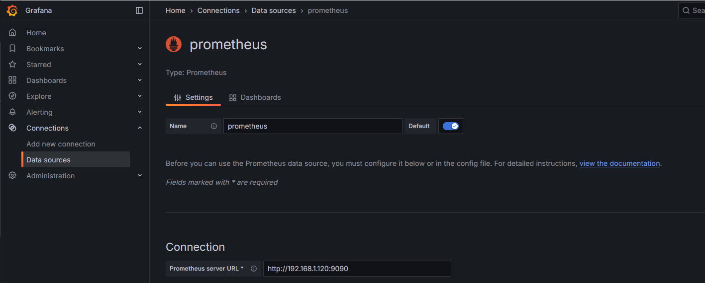
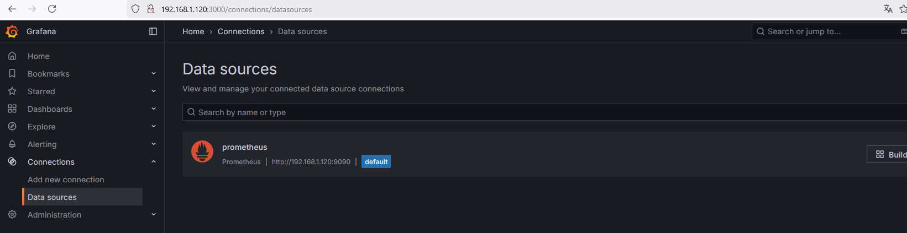
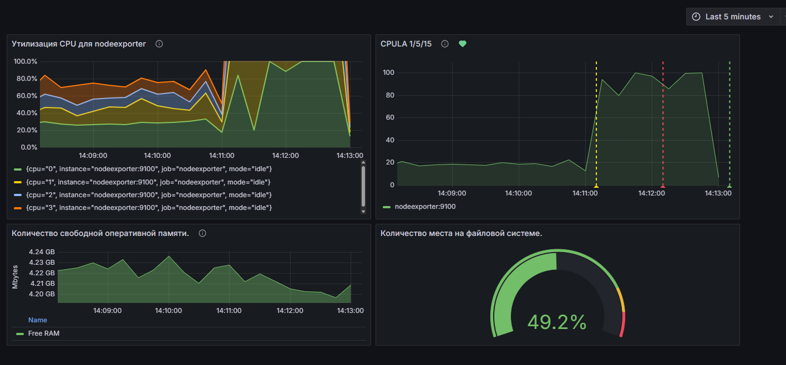

# Домашнее задание к занятию "`Средство визуализации Grafana`" - `Дедюрин Денис`

## Задание 1

1. Используя директорию [help](./help) внутри этого домашнего задания, запустите связку prometheus-grafana.
1. Зайдите в веб-интерфейс grafana, используя авторизационные данные, указанные в манифесте docker-compose.
1. Подключите поднятый вами prometheus, как источник данных.
1. Решение домашнего задания — скриншот веб-интерфейса grafana со списком подключенных Datasource.

### Ответ

Отредактировал docker-compose.yml, добавив установку актуальных версий ПО, а также проброс портов для них.

Добавление Data Source Prometheus: 





## Задание 2

Изучите самостоятельно ресурсы:

1. [PromQL tutorial for beginners and humans](https://valyala.medium.com/promql-tutorial-for-beginners-9ab455142085).
1. [Understanding Machine CPU usage](https://www.robustperception.io/understanding-machine-cpu-usage).
1. [Introduction to PromQL, the Prometheus query language](https://grafana.com/blog/2020/02/04/introduction-to-promql-the-prometheus-query-language/).

Создайте Dashboard и в ней создайте Panels:

- утилизация CPU для nodeexporter (в процентах, 100-idle);
- CPULA 1/5/15;
- количество свободной оперативной памяти;
- количество места на файловой системе.

Для решения этого задания приведите promql-запросы для выдачи этих метрик, а также скриншот получившейся Dashboard.

### Ответ

Утилизация CPU для nodeexporter (в процентах, 100-idle)
```
100 - ((irate(node_cpu_seconds_total{instance="nodeexporter:9100",mode="idle"}[5m])) * 100)
```

CPULA 1/5/15
```
100 - (avg by (instance)(irate(node_cpu_seconds_total{instance="nodeexporter:9100",mode="idle"}[5m])) * 100)
```

Количество свободной оперативной памяти;
```
node_memory_MemFree_bytes / 1024 / 1024
```

Количество места на файловой системе.
```
100 - (
  (node_filesystem_avail_bytes{instance="nodeexporter:9100", job="nodeexporter", mountpoint="/", fstype="ext4"} * 100) /
  node_filesystem_size_bytes{instance="nodeexporter:9100", job="nodeexporter", mountpoint="/", fstype="ext4"}
)
```


## Задание 3

1. Создайте для каждой Dashboard подходящее правило alert — можно обратиться к первой лекции в блоке «Мониторинг».
1. В качестве решения задания приведите скриншот вашей итоговой Dashboard.

### Ответ



## Задание 4

1. Сохраните ваш Dashboard.Для этого перейдите в настройки Dashboard, выберите в боковом меню «JSON MODEL». Далее скопируйте отображаемое json-содержимое в отдельный файл и сохраните его.
1. В качестве решения задания приведите листинг этого файла.

### Ответ

```
{
  "annotations": {
    "list": [
      {
        "builtIn": 1,
        "datasource": {
          "type": "grafana",
          "uid": "-- Grafana --"
        },
        "enable": true,
        "hide": true,
        "iconColor": "rgba(0, 211, 255, 1)",
        "name": "Annotations & Alerts",
        "type": "dashboard"
      }
    ]
  },
  "editable": true,
  "fiscalYearStartMonth": 0,
  "graphTooltip": 0,
  "id": 1,
  "links": [],
  "panels": [
    {
      "datasource": {
        "type": "prometheus",
        "uid": "eef1246toyyo0e"
      },
      "description": "Утилизация CPU (100 - idle)",
      "fieldConfig": {
        "defaults": {
          "color": {
            "mode": "palette-classic"
          },
          "custom": {
            "axisBorderShow": false,
            "axisCenteredZero": false,
            "axisColorMode": "text",
            "axisLabel": "",
            "axisPlacement": "auto",
            "barAlignment": 0,
            "barWidthFactor": 0.6,
            "drawStyle": "line",
            "fillOpacity": 30,
            "gradientMode": "none",
            "hideFrom": {
              "legend": false,
              "tooltip": false,
              "viz": false
            },
            "insertNulls": false,
            "lineInterpolation": "linear",
            "lineStyle": {
              "fill": "solid"
            },
            "lineWidth": 2,
            "pointSize": 5,
            "scaleDistribution": {
              "type": "linear"
            },
            "showPoints": "never",
            "spanNulls": false,
            "stacking": {
              "group": "A",
              "mode": "normal"
            },
            "thresholdsStyle": {
              "mode": "off"
            }
          },
          "decimals": 1,
          "mappings": [],
          "max": 100,
          "min": 0,
          "thresholds": {
            "mode": "absolute",
            "steps": [
              {
                "color": "green",
                "value": null
              },
              {
                "color": "#EAB839",
                "value": 85
              },
              {
                "color": "dark-red",
                "value": 95
              }
            ]
          },
          "unit": "percent"
        },
        "overrides": []
      },
      "gridPos": {
        "h": 9,
        "w": 10,
        "x": 0,
        "y": 0
      },
      "id": 1,
      "options": {
        "legend": {
          "calcs": [],
          "displayMode": "list",
          "placement": "bottom",
          "showLegend": true
        },
        "tooltip": {
          "hideZeros": false,
          "mode": "single",
          "sort": "none"
        }
      },
      "pluginVersion": "11.5.2",
      "targets": [
        {
          "datasource": {
            "type": "prometheus",
            "uid": "eef1246toyyo0e"
          },
          "editorMode": "code",
          "exemplar": false,
          "expr": "100 - ((irate(node_cpu_seconds_total{instance=\"nodeexporter:9100\",mode=\"idle\"}[5m])) * 100)",
          "instant": false,
          "interval": "",
          "legendFormat": "{{label_name}}",
          "range": true,
          "refId": "A"
        }
      ],
      "title": "Утилизация CPU для nodeexporter",
      "type": "timeseries"
    },
    {
      "datasource": {
        "type": "prometheus",
        "uid": "eef1246toyyo0e"
      },
      "description": "Средняя загрузка CPU за 1, 5 и 15 минут.",
      "fieldConfig": {
        "defaults": {
          "color": {
            "mode": "palette-classic"
          },
          "custom": {
            "axisBorderShow": false,
            "axisCenteredZero": false,
            "axisColorMode": "text",
            "axisLabel": "",
            "axisPlacement": "auto",
            "barAlignment": 0,
            "barWidthFactor": 0.6,
            "drawStyle": "line",
            "fillOpacity": 15,
            "gradientMode": "none",
            "hideFrom": {
              "legend": false,
              "tooltip": false,
              "viz": false
            },
            "insertNulls": false,
            "lineInterpolation": "linear",
            "lineWidth": 1,
            "pointSize": 5,
            "scaleDistribution": {
              "type": "linear"
            },
            "showPoints": "never",
            "spanNulls": false,
            "stacking": {
              "group": "A",
              "mode": "none"
            },
            "thresholdsStyle": {
              "mode": "off"
            }
          },
          "mappings": [],
          "thresholds": {
            "mode": "absolute",
            "steps": [
              {
                "color": "green",
                "value": null
              },
              {
                "color": "red",
                "value": 80
              }
            ]
          }
        },
        "overrides": [
          {
            "matcher": {
              "id": "byName",
              "options": "1 m"
            },
            "properties": [
              {
                "id": "color",
                "value": {
                  "fixedColor": "green",
                  "mode": "fixed"
                }
              }
            ]
          },
          {
            "matcher": {
              "id": "byName",
              "options": "15 m"
            },
            "properties": [
              {
                "id": "color",
                "value": {
                  "fixedColor": "dark-green",
                  "mode": "fixed"
                }
              }
            ]
          }
        ]
      },
      "gridPos": {
        "h": 9,
        "w": 10,
        "x": 10,
        "y": 0
      },
      "id": 3,
      "options": {
        "legend": {
          "calcs": [],
          "displayMode": "list",
          "placement": "bottom",
          "showLegend": true
        },
        "tooltip": {
          "hideZeros": false,
          "mode": "single",
          "sort": "none"
        }
      },
      "pluginVersion": "11.5.2",
      "targets": [
        {
          "editorMode": "code",
          "expr": "100 - (avg by (instance)(irate(node_cpu_seconds_total{instance=\"nodeexporter:9100\",mode=\"idle\"}[5m])) * 100)",
          "legendFormat": "{{label_name}}",
          "range": true,
          "refId": "A"
        }
      ],
      "title": "CPULA 1/5/15",
      "type": "timeseries"
    },
    {
      "datasource": {
        "type": "prometheus",
        "uid": "eef1246toyyo0e"
      },
      "description": "Количество свободной оперативной памяти.",
      "fieldConfig": {
        "defaults": {
          "color": {
            "mode": "palette-classic"
          },
          "custom": {
            "axisBorderShow": false,
            "axisCenteredZero": false,
            "axisColorMode": "text",
            "axisLabel": "Mbytes",
            "axisPlacement": "auto",
            "barAlignment": 0,
            "barWidthFactor": 0.6,
            "drawStyle": "line",
            "fillOpacity": 40,
            "gradientMode": "none",
            "hideFrom": {
              "legend": false,
              "tooltip": false,
              "viz": false
            },
            "insertNulls": false,
            "lineInterpolation": "linear",
            "lineWidth": 1,
            "pointSize": 5,
            "scaleDistribution": {
              "type": "linear"
            },
            "showPoints": "never",
            "spanNulls": false,
            "stacking": {
              "group": "A",
              "mode": "normal"
            },
            "thresholdsStyle": {
              "mode": "off"
            }
          },
          "mappings": [],
          "thresholds": {
            "mode": "absolute",
            "steps": [
              {
                "color": "green",
                "value": null
              },
              {
                "color": "red",
                "value": 80
              }
            ]
          },
          "unit": "decmbytes"
        },
        "overrides": []
      },
      "gridPos": {
        "h": 6,
        "w": 10,
        "x": 0,
        "y": 9
      },
      "id": 2,
      "options": {
        "legend": {
          "calcs": [],
          "displayMode": "table",
          "placement": "bottom",
          "showLegend": true
        },
        "tooltip": {
          "hideZeros": false,
          "mode": "multi",
          "sort": "none"
        }
      },
      "pluginVersion": "11.5.2",
      "targets": [
        {
          "editorMode": "code",
          "expr": "node_memory_MemFree_bytes / 1024 / 1024",
          "interval": "",
          "legendFormat": "Free RAM",
          "range": true,
          "refId": "A"
        }
      ],
      "title": "Количество свободной оперативной памяти.",
      "type": "timeseries"
    },
    {
      "datasource": {
        "type": "prometheus",
        "uid": "eef1246toyyo0e"
      },
      "fieldConfig": {
        "defaults": {
          "color": {
            "mode": "thresholds"
          },
          "decimals": 1,
          "mappings": [],
          "max": 100,
          "min": 0,
          "thresholds": {
            "mode": "absolute",
            "steps": [
              {
                "color": "green",
                "value": null
              },
              {
                "color": "#EAB839",
                "value": 80
              },
              {
                "color": "red",
                "value": 90
              }
            ]
          },
          "unit": "percent"
        },
        "overrides": []
      },
      "gridPos": {
        "h": 6,
        "w": 10,
        "x": 10,
        "y": 9
      },
      "id": 4,
      "options": {
        "minVizHeight": 75,
        "minVizWidth": 75,
        "orientation": "auto",
        "reduceOptions": {
          "calcs": [
            "lastNotNull"
          ],
          "fields": "",
          "values": false
        },
        "showThresholdLabels": false,
        "showThresholdMarkers": true,
        "sizing": "auto"
      },
      "pluginVersion": "11.5.2",
      "targets": [
        {
          "editorMode": "code",
          "expr": "100 - (\r\n  (node_filesystem_avail_bytes{instance=\"nodeexporter:9100\", job=\"nodeexporter\", mountpoint=\"/\", fstype=\"ext4\"} * 100) /\r\n  node_filesystem_size_bytes{instance=\"nodeexporter:9100\", job=\"nodeexporter\", mountpoint=\"/\", fstype=\"ext4\"}\r\n)",
          "legendFormat": "__auto",
          "range": true,
          "refId": "A"
        }
      ],
      "title": "Количество места на файловой системе.",
      "type": "gauge"
    }
  ],
  "preload": false,
  "refresh": "5s",
  "schemaVersion": 40,
  "tags": [],
  "templating": {
    "list": []
  },
  "time": {
    "from": "now-5m",
    "to": "now"
  },
  "timepicker": {},
  "timezone": "browser",
  "title": "Netology",
  "uid": "aef12y3mo7400d",
  "version": 45,
  "weekStart": ""
}
```